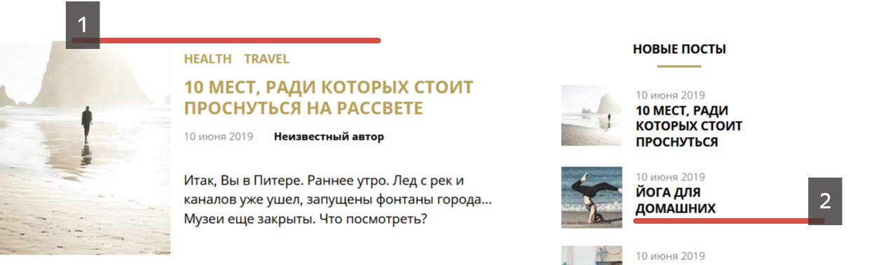
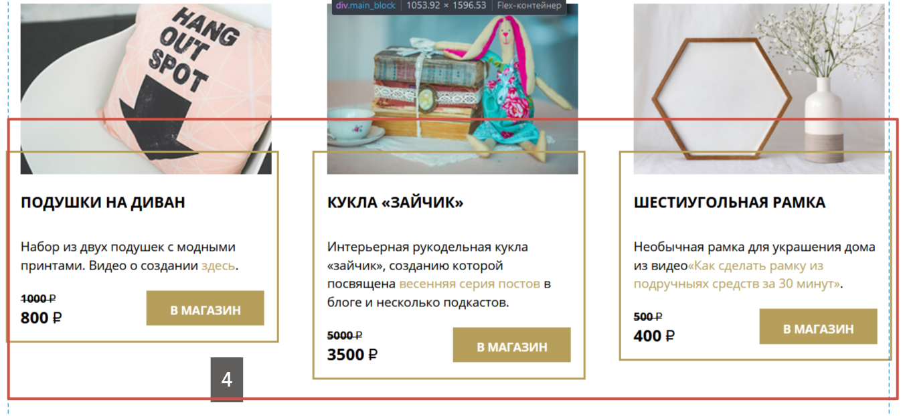

# Вопросы куратору #
1) не получилось содержание постов по верхней границы выравнить, пробовала обнулять отступы, и flex-start, vertical-align ничего не меняли
2) ширина блока и картинок в последних постах как в макете, но почему-то там в строку больше букв помещается..
   
3) не понимаю, почему в одном бразере последние посты заканчиваются выше, а в другом ниже
   
4) в блоке с товарами не смогла добиться, чтобы содержимое под картинкой растягивалось, и ширину контейнера и картинки отрегулировать

5) в popup кажется radio инпуты не совсем правильно себя ведут, и скрол страницы на фоне, и многое еще не получилось

6) вроде без загрузки фоновых картинок все остается на месте, а вот как это сделать с , не задавая строго ширину и высоту?
